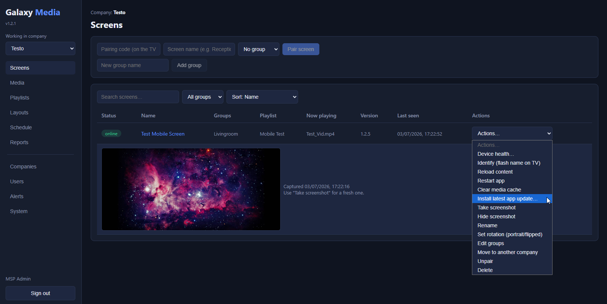

# Galaxy Media

Self-hosted digital signage for MSPs. No per-screen licensing, No "Freemium" - your server, your screens.



## What it does

- **Multi-tenant**: MSP -> companies -> screen groups -> screens, with hard isolation
  between companies. Five role levels (MSP admin/editor, company admin/editor/viewer)
  gate what each user can see and do, with per-editor company access lists for MSP
  staff who only manage some companies.
- **Content**: media library with folders - images (JPG, PNG, GIF, WebP, BMP) and
  videos (MP4, MOV, WebM, MKV), validated by content sniffing, not file extension -
  playlists (with per-item mute, live web pages), split-screen layouts (presets or
  custom zones) with scrolling tickers, and white-label branding per company.
- **Scheduling**: drag-on-calendar weekly scheduler with dayparting, overnight windows
  that correctly carry their day-of-week/date restrictions past midnight, bi-weekly/
  one-off recurrence, priorities, and a "Black Screen" mode that simulates the TV being
  off. Schedules run on the TV's own clock, so they keep switching offline.
- **Players**: a native Android TV app (TCL etc.) that caches everything locally
  (checksum-verified) and keeps playing through network outages and reboots - updates
  from releases published in the admin install per screen on command, deliberately not
  automatically, since installing needs someone on-site to approve the on-screen prompt -
  plus a zero-install **web player** (`/player` in any browser) for kiosk PCs, Raspberry
  Pis, and quick previews.
  Both pair with a 6-character code, and both support software display rotation
  (portrait / flipped) per screen for sideways-mounted menu boards.
- **Operations**: live dashboard with search/sort/filter (online/offline, now playing,
  remote reload/identify/restart/clear-cache, screenshots on demand, device health -
  battery, RAM, CPU, WiFi signal, storage, uptime - from Android player heartbeats),
  host server stats (CPU load, memory, disk space) on the System tab, offline alerts
  by email + Telegram (configurable threshold, global and per-company recipients,
  test-send), proof-of-play reports with CSV export, config export/import between
  companies, nightly backups.
- **Security**: TLS by default (plain-HTTP mode available for trusted LAN-only
  installs), Argon2id + mandatory TOTP 2FA for MSP staff, encrypted secrets
  at rest, scoped revocable device tokens, signed download URLs, rate-limited device
  pairing, audit log, hardened systemd/nginx/ufw/fail2ban deployment. See
  [SECURITY.md](SECURITY.md).

## Components

| Directory | What |
|---|---|
| `server/` | Node.js 22 + TypeScript + Fastify + PostgreSQL API |
| `admin/` | React admin UI (Vite), which also serves the web player at `/player` |
| `player-android/` | Kotlin Android TV player (Media3/ExoPlayer) |
| `deploy/` | Hardened install/update/backup scripts for an Ubuntu LXC |

See [SPEC.md](SPEC.md) for the full specification and implementation status, and
[AppBuild.md](AppBuild.md) for a step-by-step walkthrough of building the TV app.

## Install

You need two things: this server somewhere on a network your TVs can reach, and the
player APK on the TVs. Pick ONE of the server options below.

### Option A - Docker Compose (easiest)

Anything that runs Docker: a NAS, a VPS, a VM, a Raspberry Pi 4+.

```bash
git clone https://github.com/Wawoul/App-GalaxyMedia.git && cd App-GalaxyMedia
cp .env.example .env
# edit .env: set BASE_URL and generate the three secrets
#   openssl rand -hex 24   -> DB_PASSWORD
#   openssl rand -hex 48   -> JWT_SECRET
#   openssl rand -hex 32   -> ENCRYPTION_KEY
docker compose up -d
```

> **`unknown shorthand flag: 'd' in -d`?** Your Docker install is missing the Compose
> plugin (common on a bare `docker.io` apt package) - `docker` doesn't recognize
> `compose` as a subcommand at all, so it tries to parse the rest as legacy top-level
> flags. Fix: `sudo apt-get update && sudo apt-get install -y docker-compose-plugin`,
> then retry. If that package isn't available, use the official install script instead:
> `curl -fsSL https://get.docker.com | sudo sh`. (If you only have the older standalone
> `docker-compose` binary, the hyphenated `docker-compose up -d` works the same way.)

The admin UI and API are now on port 8080 (plain HTTP). Put TLS in front - any of:

- **Caddy / nginx / Traefik** reverse-proxying `localhost:8080` with a Let's Encrypt cert
- **Cloudflare Tunnel**: public hostname -> `http://<host>:8080` (free trusted TLS, no open ports)

Set `BASE_URL` in `.env` to that public https URL (TVs embed it in download links), then
`docker compose up -d` again. Log in with the `BOOTSTRAP_ADMIN_*` credentials from `.env`
and enroll 2FA. Updates: `git pull && docker compose up -d --build`.

Backups in Docker: dump the DB and copy the media volume, e.g.
`docker compose exec db pg_dump -U galaxy galaxy_media > backup.sql` on a cron.

### Option B - install script (Proxmox LXC / Ubuntu VM)

On a clean Ubuntu 24.04 machine. 1 vCPU / 1 GB RAM is enough - the whole stack
(API + PostgreSQL + nginx) idles around 300 MB; give it 2 GB if you want faster
on-box builds during install/update. Disk: ~5 GB for OS + app, then budget
about **2× your media library** on top (the live files plus the nightly local
backup, which hardlinks unchanged media so it costs one extra copy, not seven).
20 GB total is comfortable for a typical image/short-video library; video-heavy
fleets should size accordingly:

```bash
git clone https://github.com/Wawoul/App-GalaxyMedia.git && cd App-GalaxyMedia
sudo bash deploy/install.sh
```

The installer asks two or three questions - how screens reach the server
(public HTTPS domain, or **LAN-only via plain http:// and the machine's IP**),
the hostname/IP, and the first admin email - then does everything else itself:
Node 22, PostgreSQL, nginx, generated secrets, security hardening (ufw,
fail2ban, sandboxed systemd unit, unattended upgrades), and the nightly backup
timer. It ends with a summary of your admin URL, login, password, and next
steps. Updates: `sudo bash deploy/update.sh` from a fresh checkout.

**LAN-only mode**: if your TVs and admins are all on a trusted local network,
pick option 2 at the first prompt and everything runs over `http://<server-ip>`
with no domain, certificate, or tunnel needed - the player APK and web player
both work over plain HTTP. You can switch to HTTPS later by re-running the
installer in public mode. Use HTTPS for anything reachable from the internet.

### Then: put a player on each screen

**Android TVs (recommended for unattended screens - full offline support):**

1. Get the player APK: use a prebuilt one from this project's GitHub Releases, or build
   your own - full beginner walkthrough and the signing trade-offs in [AppBuild.md](AppBuild.md).
2. Upload it in the admin's **System** tab (this also gives you a download link for new TVs).
3. Sideload it once per TV (USB stick or adb), enter your server URL, pair with the
   on-screen code. All future app updates ship from the System tab automatically -
   for those OTA updates to install, allow **"Install unknown apps"** for the player
   app on each TV (Settings → Apps → Special app access), ideally during setup.

**Any browser (kiosk PCs, Raspberry Pi, quick previews - needs connectivity):**

First enable the web player in the admin's **System** tab (it is off by default). Then
open `https://your-server/player`, pair with the on-screen code, done. For a dedicated
device run the browser in kiosk mode, e.g. on a Pi or PC:

```bash
chromium --kiosk --autoplay-policy=no-user-gesture-required https://your-server/player
```

The web player supports playlists, layouts/tickers, schedules, streams, and remote
commands. It relies on the browser's cache, so prefer the Android app for screens
that must keep playing through network outages unattended.

## Development

```bash
# API server (needs PostgreSQL running; see server/config.env.example)
cd server && npm install && npm run migrate && npm run dev

# Admin UI (proxies /api to localhost:8080)
cd admin && npm install && npm run dev

# TV app: open player-android/ in Android Studio, run on an Android TV device/emulator

# Tests / typecheck
cd server && npm test && npm run typecheck
cd admin && npm run typecheck
```

## Contributing / security

Issues and PRs welcome. For vulnerabilities please follow [SECURITY.md](SECURITY.md)
(private disclosure, no public issues).
